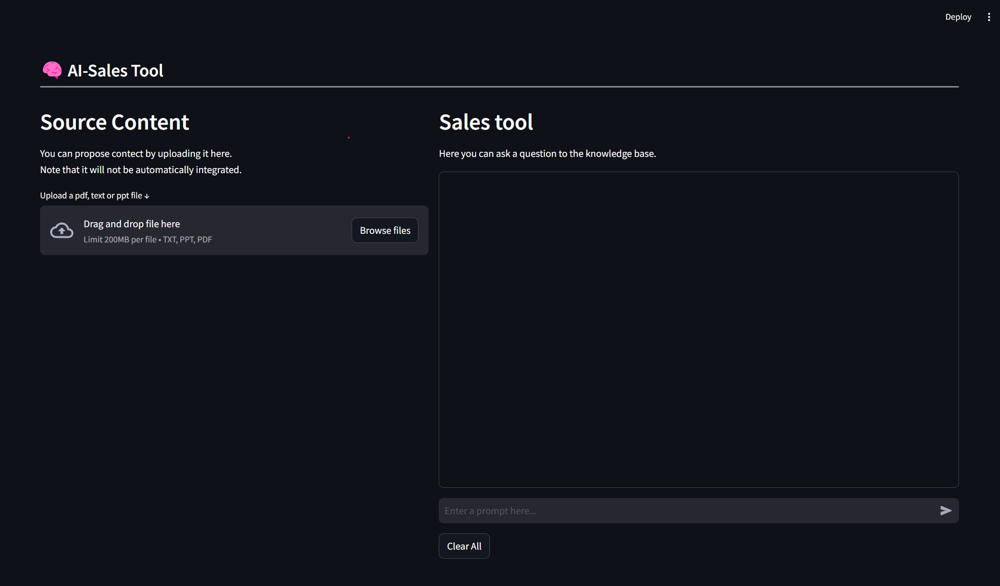

AI Sales Tool

This program is a Streamlit-based AI Sales Tool that processes user prompts to search and retrieve relevant information.

Default it run locally using ollama and llama3.2 model. For local run you need to run "ollama serve" and download LLM="llama3.2" and Embeddings="nomic-embed-text". 

Using Open AI change USE_LLM_LOCAL=False in run_sales.py and set your key as described below. 
Note that the "gpt-3.5-turbo-instruct" is Not a good model for this and I recomend using a model that support more tokens.

Additional Setup
* Add Content
* Create a folder named "text\" and add your text files.

Environment Variables
Create a .env file in the project folder if you plan to use OpanAI remote model. 
* OPENAI_API_KEY=sk-.....

Make adjustments and rename the "rename_me_to_custom.py" to "custom.py" 